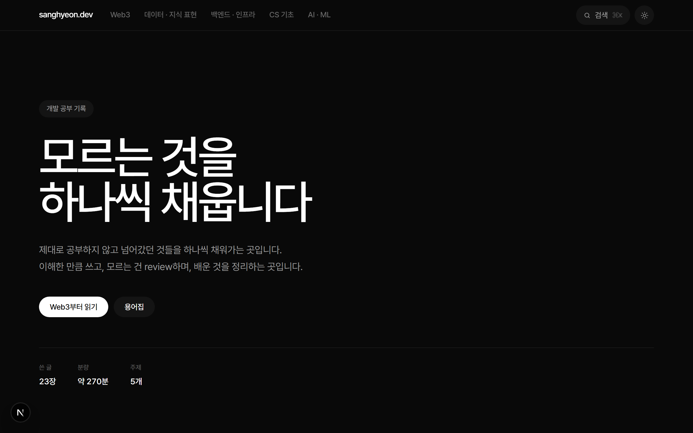
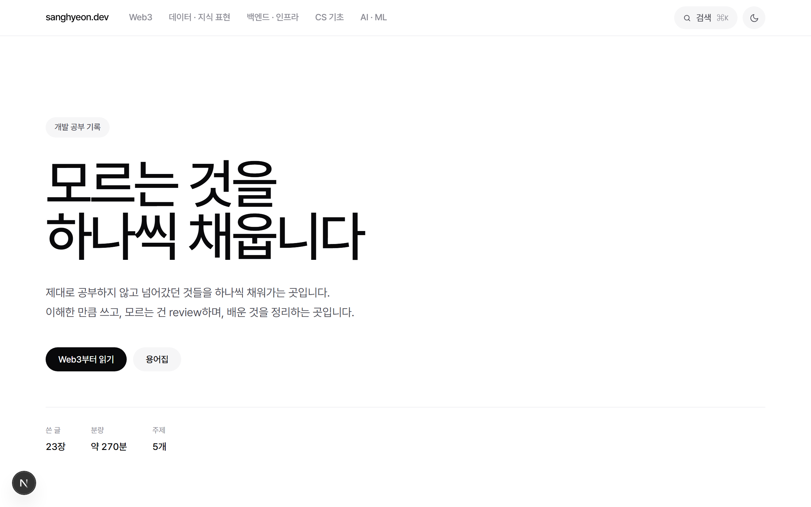
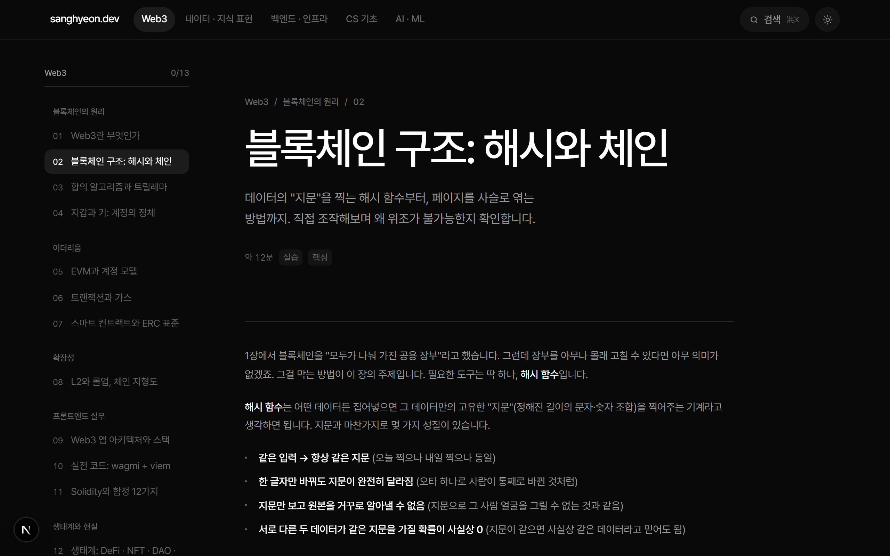

# sanghyeon.dev

동작하니까 넘어갔던 것들을 주제별로 다시 정리하는 개발 공부 기록.

독자는 **개발·컴퓨터 배경지식이 전혀 없는 완전 비전공자**를 기준으로 합니다.
모든 개념을 일상 비유로 먼저 풀고, 코드는 몰라도 본문만으로 핵심이 이해되게 씁니다.

주제(Topic) → 챕터(Doc) 2단계 구조입니다.
사이트 이름·설명·GitHub 링크는 `lib/site.ts` 한 곳에서만 관리합니다.

| 주제 | 상태 |
| --- | --- |
| `web3` | 13장 작성 완료 |
| `data` 데이터·지식 표현 | 13장 작성 완료 |
| `backend` 백엔드·인프라 | 목차만 |
| `cs` CS 기초 | 목차만 |
| `ai` AI·ML | 목차만 |

## 스크린샷

<table>
  <tr>
    <td></td>
    <td></td>
  </tr>
  <tr>
    <td align="center"><sub>홈 — 다크(기본)</sub></td>
    <td align="center"><sub>홈 — 라이트(읽기 모드)</sub></td>
  </tr>
</table>


<p><sub>챕터 페이지 — 사이드바 목차, 진도 표시, 본문</sub></p>

## 실행

```bash
npm install
npm run dev      # http://localhost:3000
npm run build    # 정적 생성
```

Node 18.18+ 필요.

## 스택

- **Next.js 16** (App Router, Turbopack) · React 19 — 전 페이지 SSG
- **Tailwind CSS v4** — 디자인 토큰은 `app/globals.css`의 CSS 변수가 원본
- **Pretendard Variable** — 동적 서브셋, npm에서 self-host (외부 요청 없음)
- **Shiki** — 빌드 타임 코드 하이라이팅 (런타임 JS 없음)

빌드 도구는 이게 전부입니다. MDX·remark·rehype 툴체인은 쓰지 않습니다.

## 디자인

`DESIGN.md`가 색·타이포·컴포넌트 스펙의 출처입니다 (Framer 스타일 — 순흑 캔버스,
흰 디스플레이 타이포에 강한 음수 자간, 단일 블루 액센트, 그라디언트 스포트라이트 카드, 필 버튼).

두 가지를 의도적으로 다르게 했습니다.

- **본문 line-height를 늘렸습니다.** 스펙의 1.30은 마케팅 카피 기준이고, 여기는 한글 장문을
  읽는 곳입니다. 크기와 음수 자간은 그대로 둡니다.
- **라이트 모드를 남겼습니다.** 다크가 기본이자 정체성이고, 라이트는 스펙 밖의 '읽기 모드'입니다.

## 구조

```
app/
  layout.tsx                 루트 레이아웃 · 테마 부트스트랩 · 푸터
  page.tsx                   홈 (히어로 + 주제 그리드 + 스포트라이트 카드)
  globals.css                디자인 토큰 + Pretendard + Shiki 테마 전환
  [topic]/layout.tsx         사이드바가 있는 주제 셸
  [topic]/page.tsx           주제 표지 (챕터 목록 또는 예정 목차)
  [topic]/[slug]/page.tsx    챕터 페이지
  glossary/ quiz/            부록
components/
  Blocks.tsx                 Block[] 렌더러 (서버 · Shiki 하이라이팅)
  Inline.tsx                 문단 안의 **굵게** `코드` [링크] 렌더
  CodeBlock · Tabs · Demo · Demos      상호작용 조각 (client)
  Header · Sidebar · Search · ThemeToggle · ReadMark · Quiz
content/
  {topic}/{slug}.ts          본문 데이터 (Block[])
lib/
  site.ts                    사이트 이름·설명·GitHub 링크 — 여기만 고치면 전체 반영
  content.ts                 주제·챕터 메타데이터 — 단일 출처
  blocks.ts                  본문 블록 타입 + 인라인 파서
  highlight.ts               Shiki 하이라이터 (캐시)
  progress.ts                localStorage 진도
  quiz.ts                    퀴즈 문항
```

## 콘텐츠 작성

본문은 MDX가 아니라 **데이터**입니다. `content/{topic}/{slug}.ts`가 `Block[]`을
default export 합니다.

```ts
import type { Block } from "@/lib/blocks";

const blocks: Block[] = [
  { t: "p", md: "가스는 이더리움에서 어떤 작업을 하느냐에 따라 매겨지는 가격표입니다. **수수료**는 실제로 쓴 작업량과 단가를 곱해서 정해집니다." },

  { t: "callout", tone: "fe", title: "일상 비유로 한 문장", body: [
    { t: "p", md: "택배 배송비가 무게와 거리에 따라 달라지는 것과 비슷합니다." },
  ]},

  { t: "code", lang: "ts", src: `
const { gas } = await estimate({ to, value })
` },

  { t: "demo", name: "gas" },
];

export default blocks;
```

데이터라서 좋은 점: 코드 예제에 `{`, `${`, `<`를 넣어도 이스케이프가 필요 없고,
오타 난 `tone`이나 빠진 필드는 빌드가 잡아줍니다.

블록 종류와 인라인 문법은 `CLAUDE.md`의 표를, 타입은 `lib/blocks.ts`를 보세요.

### 챕터 추가

1. `content/{topic}/{slug}.ts` 생성
2. `lib/content.ts`의 `docs` 배열에 항목 추가
3. 끝 — 사이드바·검색·이전/다음·정적 경로가 자동 반영됩니다

## 콘텐츠 출처

web3 주제의 수치·날짜는 2026년 7월 기준으로 검증했습니다. 주요 출처는 13장 말미에 있습니다.

- [Building on Ethereum in 2026 — ethereum.org](https://ethereum.org/latest/building-on-ethereum-in-2026/)
- [wagmi 공식 문서](https://wagmi.sh)
- [L2BEAT](https://l2beat.com) · [DeFiLlama](https://defillama.com)

data 주제도 2026년 7월 기준입니다. 각 장의 `legend` 블록에 출처를 남겼습니다.

- [RFC 9562 — UUIDs](https://www.rfc-editor.org/info/rfc9562/) (4장)
- [Palantir Foundry — Ontology core concepts](https://www.palantir.com/docs/foundry/ontology/core-concepts) (6장)
- [Edge et al., *From Local to Global: A Graph RAG Approach*](https://arxiv.org/abs/2404.16130) (6장)
- [Cormack et al., *Reciprocal Rank Fusion…*, SIGIR '09](https://cormack.uwaterloo.ca/cormacksigir09-rrf.pdf) (10장)

3장의 테이블 포맷 현황은 변화가 빨라 재확인이 필요합니다.

파트 4(11~13장)는 2026년 8월 기준입니다.

- [OpenLineage 공식 문서](https://openlineage.io/docs/) · [LF AI & Data](https://lfaidata.foundation/projects/openlineage/) (11장)
- [Open Data Contract Standard](https://bitol-io.github.io/open-data-contract-standard/) · [Bitol](https://bitol.io/) (12장)
- 개인정보 보호법 제16조 — [국가법령정보센터](https://www.law.go.kr/) (13장)
- 개인정보보호위원회 「가명정보 처리 가이드라인」 전면 개정(2026.3) — [정책브리핑](https://www.korea.kr/briefing/pressReleaseView.do?newsId=156751967) (13장)

**13장은 법률 자문이 아닙니다.** 개인정보 관련 법령·지침은 개정이 잦으므로,
인용하거나 실무에 적용하기 전에 반드시 원문과 최신 공지를 직접 확인하세요.

## 이미지 출처

`public/og/`의 다이어그램은 위키미디어 커먼즈에서 가져와 OG(소셜 공유) 이미지에만 사용합니다.

- `blockchain.svg` — [Blockchain.svg](https://commons.wikimedia.org/wiki/File:Blockchain.svg), Theymos(Bitcoin Wiki) 원작·Razorbliss 벡터화, [CC BY 3.0](https://creativecommons.org/licenses/by/3.0). 다크 배경에서 보이도록 stroke 색만 바꿨습니다.
- `graph-database.svg` — [GraphDatabase PropertyGraph.svg](https://commons.wikimedia.org/wiki/File:GraphDatabase_PropertyGraph.svg), Ole Mussmann, [CC0](https://creativecommons.org/publicdomain/zero/1.0/deed.en).

## 라이선스

학습 목적 자료입니다. 투자 조언이 아닙니다.
